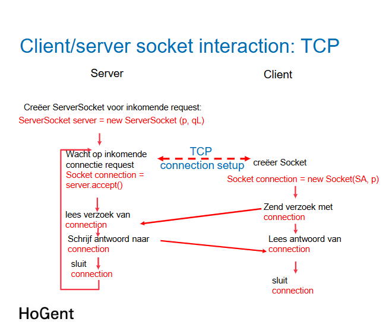

Socket = end-point van een verbinding

## **Eigenschappen**

- **ServerSocket** is een klasse die een socket vertegenwoordigt die verbindingen van clients accepteert.
- **De constructor van ServerSocket** neemt twee argumenten:
  - **portNumber:** het poortnummer waarop de server verbindingen accepteert.
  - **queueLength:** het maximale aantal verbindingen dat in de wachtrij kan staan voordat een client een connectiefout ontvangt.
- **Een geldig poortnummer ligt tussen 0 en 65565.**
- **Een poging om een poort te gebruiken die al in gebruik is of geen geldig nummer heeft, leidt tot een `BindException`.**

## Een eenvoudige Server met Stream Sockets opzetten

```java
public class Server {
private ServerSocket server;
private Socket connection;
public void start() throws IOException {
try {
// Stap 1: creëer een ServerSocket-object
server = new ServerSocket(portNumber,queueLength);
// Stap 2: de server luistert onafgebroken
// naar een poging van een client om een connectie te maken
while (true) {
    //methode accept levert een Socket af wanneer een connecti emet een client tot stand gekomen is
    connection = server.accept();
    //Door de Socket kande server interageren met de client


              // ObjectOutputStream voor het verzenden van objecten naar client
            OutputStream out = connection.getOutputStream();
    						// Flusht het ObjectOutputStream-object om alle gegevens te verzenden
            out.flush()
    						// ObjectInputStream voor ontvangen van objecten
            InputStream in = connection.getInputStream();

              // Stap 4: tijdens de verwerkingsfase communiceren
              // de server en de client via de OutputStream- en InputStream-objecten
              // ...
              //hier worden dus alle transacties gedaan: verzenden en ontvangen tussen client en server
          }
      } catch (IOException ex) {
          System.out.println("No ServerSocket : " + ex.getMessage());
      } finally {
          // Wordt hier wel nooit uitgevoerd omdat while oneindig lang loopt
          // Stap 5: wanneer de transmissie is afgehandeld,
          // sluit de server de connectie
          connection.close();
      }

}
}

```

**Eigenschappen:**

- **Socket** is een klasse die een socket vertegenwoordigt die verbindingen met servers kan maken.
- **De constructor van Socket** neemt twee argumenten:
  - **serverAddress:** het IP-adres van de server.
  - **portNumber:** het poortnummer van de server.
- **Een geldig poortnummer ligt tussen 0 en 65535.**
- **Een poging om een connectie te maken met een server die niet bestaat of die geen verbindingen accepteert, leidt tot een `IOException`.**

### Een eenvoudige Client met Stream Sockets opzetten

```java

public class Client {

    private Socket clientSocket;

    public void start() {
        try {
            // Stap 1: de Socket constructor legt
            // een connectie met de server
            ////Als de connectie tot stand gebracht is, dan wordt een Socket afgeleverd
            clientSocket = new Socket(ServerAddress, portNumber);

            // Stap 2: de client gebruikt de methoden getInputStream() en
            //getOutputStream() om referenties naar InputStream en
            // OutputStream te verkrijgen
            InputStream in = connection.getInputStream();
            OutputStream out = connection.getOutputStream();

            // Stap 3: tijdens de verwerkingsfase communiceren
            // de server en de client
            // via de OutputStream en InputStream objecten
            // ...

            // Stap 4: wanneer de transmissie is afgehandeld,
            //sluit de client de connectie door de methode close()
            // aan te roepen op de streams en op de Socket
            connection.close();
        } catch (EOFException eofException) {
            System.out.println("\nServer terminated connection");
        } catch (IOException ex) {
            System.out.println(ex.getMessage());
        } finally {
            this.clientSocket.close()
        }
    }
}
```



## VOORBEELD: ONTVANGEN CLIENTMESSAGE + SERVER GEEFT RESPONSE TERUG

```java
import java.io.*;
import java.net.*;

public class Server {
    private ServerSocket server;
    private Socket connection;
    private final int portNumber = 12345;
    private final int queueLength = 50;

    public void start() throws IOException {
        try {
            // Stap 1: creëer een ServerSocket-object
            server = new ServerSocket(portNumber, queueLength);

            // Stap 2: de server luistert onafgebroken naar connectiepogingen
            while (true) {
                connection = server.accept(); // Wacht op client-connectie
                System.out.println("Client verbonden!");

                // OutputStream voor verzenden van objecten naar client
                OutputStream out = connection.getOutputStream();
                out.flush(); // Flush output stream

                // InputStream voor ontvangen van objecten van client
                InputStream in = new connection.getInputStream();

                // Stap 4: communicatie met de client
                try {
                    // Ontvang bericht van client
                    String clientMessage = (String) in.readObject();
                    System.out.println("Bericht ontvangen van client: " + clientMessage);

                    // Verwerk bericht en stuur antwoord terug
                    String serverResponse = "Server zegt: " + clientMessage.toUpperCase();
                    out.writeObject(serverResponse); // Verstuur antwoord naar client
                    out.flush();
                    System.out.println("Bericht verzonden naar client: " + serverResponse);
                } catch (ClassNotFoundException e) {
                    System.out.println("Fout bij het lezen van het object: " + e.getMessage());
                } finally {
                    // Stap 5: sluit connectie
                    connection.close();
                }
            }
        } catch (IOException ex) {
            System.out.println("Geen ServerSocket: " + ex.getMessage());
        } finally {
            if (server != null) server.close();
        }
    }
}
```

## VOORBEELD BIJ CLIENT

```java
import java.io.*;
import java.net.*;

public class Client {
    private Socket clientSocket;
    private final String serverAddress = "localhost"; // Server-adres (localhost voor lokaal)
    private final int portNumber = 12345; // Serverpoort

    public void start() {
        try {
            // Stap 1: verbind met de server
            clientSocket = new Socket(serverAddress, portNumber);
            System.out.println("Verbonden met de server!");

            // OutputStream voor verzenden van objecten naar server
            OutputStream out = clientSocket.getOutputStream()
            out.flush();

            // InputStream voor ontvangen van objecten van server
            InputStream in = new clientSocket.getInputStream();

            // Stap 3: communicatie met de server
            try {
                // Verzend bericht naar de server
                String message = "Hallo Server!";
                out.writeObject(message); // Verzend bericht
                out.flush();
                System.out.println("Bericht verzonden naar server: " + message);

                // Ontvang antwoord van de server
                String serverResponse = (String) in.readObject();
                System.out.println("Antwoord van server: " + serverResponse);
            } catch (ClassNotFoundException e) {
                System.out.println("Fout bij het lezen van het object: " + e.getMessage());
            } finally {
                // Stap 4: sluit connectie
                clientSocket.close();
                System.out.println("Connectie gesloten.");
            }
        } catch (IOException ex) {
            System.out.println("IO Fout: " + ex.getMessage());
        }
    }

    public static void main(String[] args) {
        Client client = new Client();
        client.start();
    }
}

```

## tip: enige verschil met server en client is: bij client gebruik je ClientSocket en heb je geen while(true)
