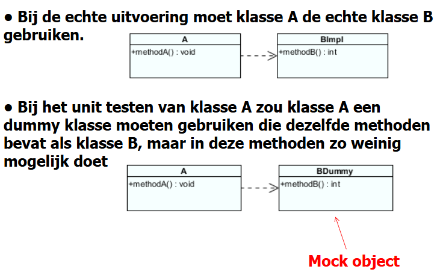
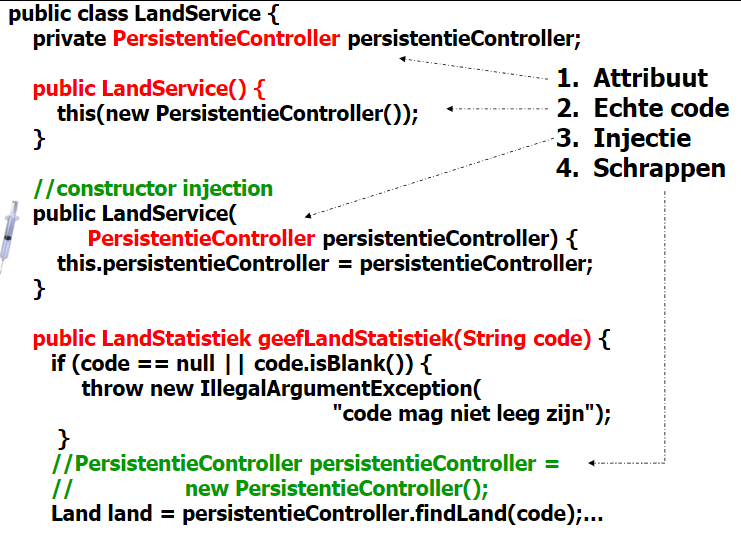

## [MOCKING]

### Mockito Framework

- nep-objecten, ze worden gebruikt door echte code die getest wordt

### Voorbeeld:



- de persistentie laag hebben we hier niet onder controle, hiervoor gebruiken we mocking om een fake 'mock-object' te maken. Hierop kunnen we dan verder de klasse testen.



- Attribuut (DEPENDENCY)
- Echte code (default constructor)
- Injectie (Voor de fake)
- Schrappen (belangrijk, anders heeft derest van de code geen effect)

### Annotaties

- @ExtendWith(MockitoExtension.class)
- @Mock
- @InjectMock

1. De te testen klasse en het mock object aanmaken. De mock injecteren in het te testen object.

```java
   /Junit5 uitbreiden met Mockito
   @ExtendWith(MockitoExtension.class)
   class LandServiceTest{

    //Het mockobject aanmaken
    @Mockprivate PersistentieController persistentieControllerDummy;

    /*De te testen klasse aanmaken. De mockwordt geïnjecteerd    (via constructioninjection, indien geen: via setter injection). Werkt zoals @BeforeEach*/
    @InjectMocksprivate LandServicelandService;
    }
```

2. Mock trainen

```java

private static final int oppervlakte= 110;

@ParameterizedTest@CsvSource({ "BE, 10, 0.1", "NL, 22, 0.2", "DE, 78, 0.7" })
public voidtestGeefLandStatistiekScenario(String landCode, int landOppervlakte, double verwachteResultaat) {

//Het mockobject trainen
Mockito.when(persistentieControllerDummy.findLand(landCode)).thenReturn(new Land(landCode, landOppervlakte));

Mockito.when(persistentieControllerDummy.findOppervlakteAlleLanden()).thenReturn(oppervlakte);
```

3. Controles uitvoeren (assertions), na de test verifieren of de mock goed opgeroepen werd

```java
@ParameterizedTest@CsvSource({ "BE, 10, 0.1", "NL, 22, 0.2", "DE, 78, 0.7" })
public void testGeefLandStatistiekScenario(String landCode, int landOppervlakte, double verwachteResultaat) {
    Mockito.when(persistentieControllerDummy.findLand(landCode)).thenReturn(new Land(landCode, landOppervlakte));
    Mockito.when(persistentieControllerDummy.findOppervlakteAlleLanden()).thenReturn(oppervlakte);
    LandStatistiekstat = landService.geefLandStatistiek(landCode);assertEquals(landCode, stat.landCode());
    assertEquals(verwachteResultaat, stat.verhouding(), 0.01);

    // Na de test verifiëren: werd de methode findLandmet argument landCodeéén   //keer opgeroepen
    Mockito.verify(persistentieControllerDummy).findLand(landCode);//Analoog voor de methode findOppervlakteAlleLanden
    Mockito.verify(persistentieControllerDummy).findOppervlakteAlleLanden()
```

3. We voeren onze verwerking uit:

```java
landService.geefLandStatistiek(landCode)
```

3. Vervolgens kunnen we door ‘verify’ testen indien de methode findLand, met argument landCode, één keer, in de dummy, werd opgeroepen

```java
Mockito.verify(persistentieControllerDummy).findLand(landCode);
```

3.1 Speciale gevallen testen

```java
@ParameterizedTest
@NullAndEmptySource
@ValueSource(strings = { "        " })
public voidlege_spaties_nullCode(String landCode) {
    assertThrows(IllegalArgumentException.class, () -> {
        landService.geefLandStatistiek(landCode);});
    }
```

4. Land bestaat niet testen

```java
@Testpublic void landBestaatNiet() {
    final String CODE_GEEN_LAND = "GEEN_LAND";
    //mock trainen
    Mockito.when(persistentieControllerDummy.findLand(CODE_GEEN_LAND)).thenReturn(null);
    Mockito.lenient().when(persistentieControllerDummy.findOppervlakteAlleLanden()).thenReturn(100);
    //lenient: zie volgende slide
    assertNull(landService.geefLandStatistiek(CODE_GEEN_LAND));
    //We verwachten dat de methode findLand één keer werd opgeroepen
    Mockito.verify(persistentieControllerDummy).findLand(CODE_GEEN_LAND);
    //We verwachten dat de methode findOppervlakteAlleLanden niet werd opgeroepen
    Mockito.verify(persistentieControllerDummy, Mockito.times(0)).findOppervlakteAlleLanden()
```
